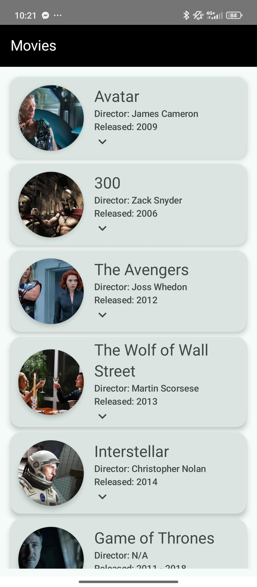
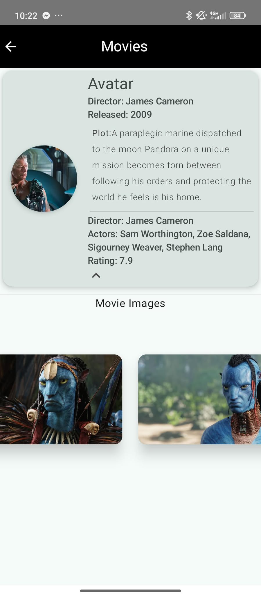

# 🎬 Jetpack Compose Movie App

A lightweight Android Movie App built with **Jetpack Compose**, featuring a scrollable list of movies and a detailed info screen for each title.

---

## 🧩 About the App

This app is a simple demonstration of modern Android UI development using **Jetpack Compose**. It displays a **static list of movies** with titles, posters, and brief info, and allows users to tap on any movie to see more details.

---

## 📱 Features

- 🧾 **Movie List Screen** – Scroll through a list of popular movies.
- 📄 **Movie Details Screen** – Tap on a movie to view its full details including title, poster, release year, genre, and description.
- 📷 **Poster Previews** – Uses local images or network resources for movie posters.
- ⚡ **Jetpack Compose UI** – Smooth, declarative UI built with Material 3.

---

## 🛠️ Tech Stack

- **Jetpack Compose** – Modern declarative UI framework for Android.
- **Material 3** – Clean and responsive design system.
- **Navigation Compose** – Simple navigation between list and detail screens.
- **Coil** – For loading images if posters are from URLs.

---

## 📸 Screenshots

### 🎞️ Movie List Screen

  

- Displays a scrollable list of movie titles with posters.

---

### 📃 Movie Details Screen

  

- Shows full details for the selected movie.

---

## 🚀 Future Improvements

- Integrate with a real API (e.g. TMDb or OMDb).
- Add search and filter functionality.
- Support for genres, trailers, and ratings.
- Add persistent favorites.
- Light/dark mode toggle.
